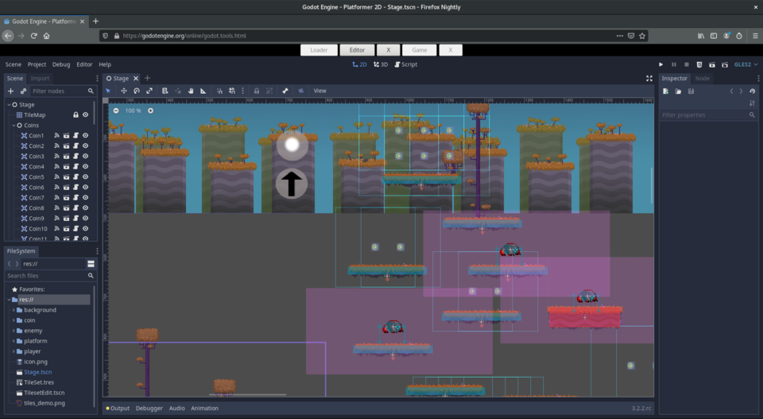

<!-- _class: lead -->


# Think Different
## Learning from GDScript about how programming could look like

---

From Python and similar programming languages we learned to think in `files`,
`classes` and `functions`.

```
.
├─file1
├─file2
├─dir1/
  ├─file3
  └─file4
└─dir2/
  └─file5
```
---

But what if we connect the objects in trees?
What if we connect scripts to objects?
What if invocation happens on events only?

```
                      scene1
                      /    \
                    obj1   obj2 -> script1
                   /    \
                obj3   obj3 -> script2
```
---

In such an environment the objects become more meaningful.
And how they interact and connect.

```
                      scene1
                      /    \
                    obj1   obj2 -> script1
                   /    \
                obj3   obj3 -> script2
```

---

## And this is not a coincidence...

---



From the Godot developer's perspective everything is an object.

---


Player? Object. Coin? Object. Health bar? Object.

---


For game developers objects are something you can:
 - touch! 🤝
 - move! 🏇
 - draw! 🎨 
[scene from Tilt Brush Demo](https://www.youtube.com/watch?v=LBJPIgNXUDI)

---

 * https://stackoverflow.com/questions/3295938/else-clause-on-python-while-statement
 * sets
 * types
 * func vs def (minor terms)
 * math is slightly different (division)
 * `get_type()` and `typeof()` and `get_class()` and groups

---

 * GDScript is better integrated with graphical elements
 * Signals as event system
 * Files are automatically extensions of a baseclass, based on the nod graph
 * some functions like `random` are implemented slightly differently
 * no `with` statements
 * the file-local class doesn't need to be named, but then cannot be called by name in other files.

---

# Simple Example
## Python

```python
def hi():
  print("hello world")
```

## GDScript

```python
func hi() -> void:
  print("hello world")
```
---

# Questions?
# No?
# Great.
